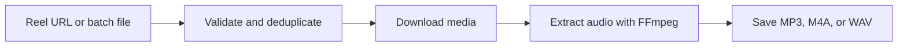

<p align="center">
  <a href="https://fluxnote.io">
    
  </a>
</p>

# Instagram Reels Audio Downloader — FluxNote

Turn an Instagram Reel link into an audio file with a simple **Python command-line tool**. Save **MP3, M4A, or WAV** files locally, download multiple Reels in a batch, and optionally use your browser session when Instagram requires login.

<a href="https://fluxnote.io">
  
</a>

<p align="center">
  <strong><a href="https://fluxnote.io">Start creating free ↗</a></strong>
  &nbsp; &nbsp; · &nbsp; &nbsp;
  <a href="#quick-start">Download audio locally</a>
  &nbsp; &nbsp; · &nbsp; &nbsp;
  <a href="https://fluxnote.io/developers">FluxNote API documentation</a>
</p>

<p align="center">
  <strong>Follow FluxNote</strong><br /><br />
  <a href="https://www.instagram.com/fluxnote.io/" title="FluxNote on Instagram"></a>
  &nbsp;
  <a href="https://www.tiktok.com/@fluxnote" title="FluxNote on TikTok"></a>
  &nbsp;
  <a href="https://www.youtube.com/@fluxnote" title="FluxNote on YouTube"></a>
  &nbsp;
  <a href="https://x.com/fluxnote_" title="FluxNote on X"></a>
  &nbsp;
  <a href="https://www.linkedin.com/company/fluxnote" title="FluxNote on LinkedIn"></a>
</p>

**Open-source code, local audio extraction.** The code here is MIT licensed. Downloads run on your computer using yt-dlp and FFmpeg. No FluxNote account, API key, or paid API is required. Instagram may require a logged-in session or restrict access to a Reel.

## What it does

- Downloads a Reel's soundtrack as MP3, M4A, or WAV.
- Accepts one URL, multiple URLs, or a text file of Reel links.
- Removes tracking parameters and skips duplicate URLs within a run.
- Supports optional browser cookies or a Netscape-format cookies file.
- Saves predictable filenames such as `SHORTCODE.mp3` without overwriting existing audio.



The output contains the Reel's complete mixed soundtrack, including speech and effects. It does not isolate music or retrieve a separate original song.

## Quick start

Requirements: **Python 3.10+** and **FFmpeg**, including `ffprobe`, on your PATH. The Python installation below also installs yt-dlp.

Open a terminal in this repository's root directory.

### Install FFmpeg

```bash
# macOS
brew install ffmpeg

# Ubuntu / Debian
sudo apt install ffmpeg
```

On Windows, get a build from [FFmpeg's download page](https://ffmpeg.org/download.html) and add its `bin` folder to PATH. Verify both `ffmpeg -version` and `ffprobe -version` work.

### Install the downloader

```bash
# macOS / Linux
python3 -m venv .venv
source .venv/bin/activate
python -m pip install -e .
```

```powershell
# Windows PowerShell
python -m venv .venv
.venv\Scripts\Activate.ps1
python -m pip install -e .
```

### Download your first Reel

```bash
reel-audio 'https://www.instagram.com/reel/SHORTCODE/'
```

Replace `SHORTCODE` with a real Reel ID. The command saves `downloads/SHORTCODE.mp3` and prints the final path after extraction. `python -m instagram_reels_audio` also works. Run `reel-audio --help` for all options.

## Examples you can customize

| Example | Options | Purpose |
| --- | --- | --- |
| MP3 | Default | Save audio as a 192 kbps MP3 |
| M4A | `--format m4a` | Save audio in an M4A container |
| WAV | `--format wav` | Save uncompressed audio for editing |
| Custom bitrate | `--quality 320` | Request a 320 kbps lossy audio bitrate |
| Custom folder | `--output ./audio` | Choose where files are saved |
| Batch file | `--batch-file reels.txt` | Process a list of Reel URLs sequentially |

```bash
reel-audio 'https://www.instagram.com/reel/SHORTCODE/' --format m4a --output ./audio
reel-audio 'https://www.instagram.com/reel/SHORTCODE/' --format mp3 --quality 320
reel-audio 'https://www.instagram.com/reel/SHORTCODE/' --format wav
```

Quality choices are `128`, `192`, `256`, and `320` kbps; the default is `192`. Quality is ignored for WAV. Converting to WAV or a higher bitrate cannot improve the source quality. To save another bitrate of the same Reel, choose a different output directory because existing audio files are preserved.

## Download multiple Reels

Pass several quoted URLs in one command:

```bash
reel-audio 'https://www.instagram.com/reel/FIRST_ID/' 'https://www.instagram.com/reel/SECOND_ID/'
```

Or create `reels.txt` with one URL per line:

```text
# Reels to download
https://www.instagram.com/reel/FIRST_ID/
https://www.instagram.com/reel/SECOND_ID/
```

```bash
reel-audio --batch-file reels.txt --output ./audio
```

Blank lines and lines starting with `#` are ignored. All URLs are validated before downloading, and each unique Reel is processed sequentially. One failed download does not stop the remaining URLs.

## When Instagram requires login

Log into Instagram in your browser, then explicitly opt into reading that session:

```bash
reel-audio 'https://www.instagram.com/reel/SHORTCODE/' --cookies-from-browser firefox
```

Alternatively, use an existing Netscape-format cookies file:

```bash
reel-audio 'https://www.instagram.com/reel/SHORTCODE/' --cookies ./cookies.txt
```

Use one authentication option at a time. Browser cookie access may require closing the browser or unlocking its credential store. Cookies do not guarantee access to unavailable or restricted content.

Cookies are credentials: keep them local and never commit them or attach them to an issue. This tool does not ask for your password or send cookies to a separate download service. yt-dlp uses the selected session to request media.

## How the download works

| Step | Behavior |
| --- | --- |
| Validate input | Accept direct Instagram `/reel/ID/` and `/reels/ID/` links |
| Normalize links | Remove tracking parameters and deduplicate within the run |
| Fetch media | Use yt-dlp with optional user-selected cookies |
| Extract soundtrack | Use FFmpeg to produce the requested audio format |
| Save audio | Print the final file path and preserve existing audio files |

Profiles, stories, `/share/` links, and audio collection pages are not supported. Open a shared link in Instagram and copy its direct Reel URL first. Videos may be downloaded temporarily during extraction.

Exit status is `0` on success, `1` if a download or setup fails, `2` for invalid arguments, and `130` when cancelled.

## Troubleshooting

Instagram can require login, rate-limit requests, or change its endpoints. If downloads stop working, update the extractor first:

```bash
python -m pip install --upgrade yt-dlp
```

If the stable release still fails, try `python -m pip install --upgrade --pre yt-dlp` and consult [yt-dlp's documentation](https://github.com/yt-dlp/yt-dlp#readme). For missing FFmpeg errors, check that both `ffmpeg` and `ffprobe` are on your PATH. For login errors, try your own authenticated browser session using the option above.

## Test without an Instagram account

With the project and FFmpeg installed:

```bash
python -m unittest discover -s tests -v
```

Tests cover URL validation, command construction, batch failures, and real audio extraction from a generated local video. They make no requests to Instagram and need no credentials. GitHub Actions runs the suite on Linux and Windows with Python 3.10 and 3.12.

## Build something useful

Start with one Reel, inspect the audio, and adapt the format or batch input for your workflow. Download content you own or have permission to use, and review usage rights before publishing.

For AI image and video creation, visit [FluxNote](https://fluxnote.io). For hosted generation integrations, see the [developer documentation](https://fluxnote.io/developers).

**Ready to create your next video? [Start creating with FluxNote →](https://fluxnote.io)**

## License and support

[MIT](LICENSE) applies to this repository's code and documentation. FluxNote branding and trademarks remain the property of their owners. [yt-dlp](https://github.com/yt-dlp/yt-dlp) and [FFmpeg](https://ffmpeg.org/) have their own licenses. This project is not affiliated with Instagram or Meta, and its license does not grant rights to downloaded media.

For downloader bugs, open a GitHub issue with your OS, Python and yt-dlp versions, a minimal reproduction, and a redacted error log. **Never include cookies, account credentials, or private media.** See [CONTRIBUTING.md](CONTRIBUTING.md) to contribute. For FluxNote account or billing questions, email support@fluxnote.io.
